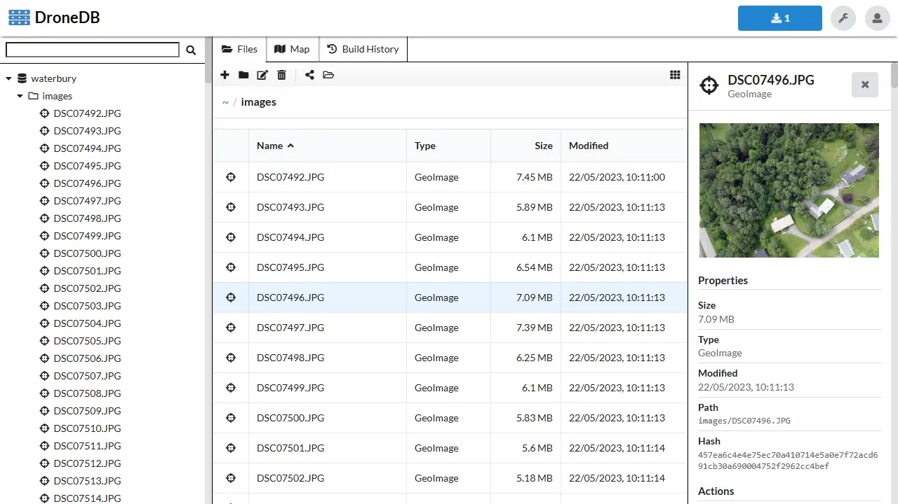
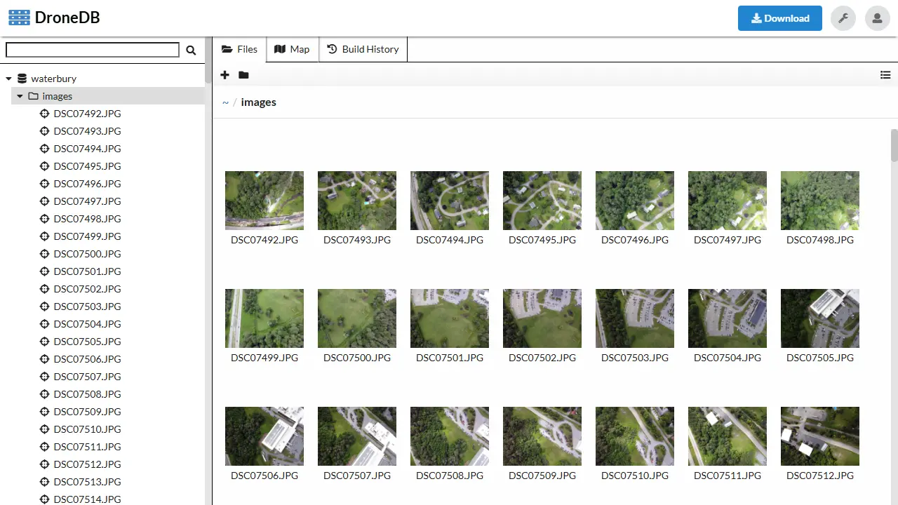

# Desktop

DroneDB Desktop is a powerful application for browsing, inspecting, and sharing aerial data. It provides an intuitive interface for working with drone imagery, point clouds, and other geospatial files.

## Installation

import Tabs from '@theme/Tabs';
import TabItem from '@theme/TabItem';
import WindowsSetupImage from '@site/docs/assets/windows_setup.webp';

<Tabs>
  <TabItem value="windows" label="Windows" default>
    <ul><li>Download the latest release from <a href="https://github.com/DroneDB/DroneDB/releases/latest">GitHub Releases</a></li></ul>
    
  </TabItem>
</Tabs>

:::info Platform Support
DroneDB Desktop is currently available for **Windows only**. Linux users can use the [CLI](./cli) for command-line access to DroneDB features.
:::

## Features

### File Browser
Browse your aerial data files with rich previews and metadata extraction.

Switch to list view with thumbnails for a compact overview:

### Synchronized Map View
View files on a map synchronized with the file browser. Click on the map to highlight files, or select files to see their locations.

### Key Capabilities

| Feature | Description |
|---------|-------------|
| **Browse Aerial Data** | View images, videos, point clouds, and other geospatial files |
| **Synchronized Views** | Map and file list are synchronized for easy navigation |
| **Metadata Extraction** | Automatic EXIF and GPS data extraction |
| **Copy/Cut/Paste** | Standard filesystem operations |
| **Quick Share** | Share directly to [Hub](https://hub.dronedb.app) |
| **Format Support** | JPG, TIFF, DNG, LAS, LAZ, PLY, OBJ, GLTF, GLB, GeoJSON, KML, and more |

### Supported File Types

| Category | Formats |
|----------|---------|
| **Images** | JPG, JPEG, DNG, TIF, TIFF, PNG, GIF, WEBP |
| **Videos** | MP4, MOV |
| **Point Clouds** | LAS, LAZ, PLY* |
| **3D Models** | OBJ, GLTF, GLB, PLY* |
| **Vector Data** | GeoJSON, KML, KMZ, SHP, SHZ, DXF, DWG, FGB, TopoJSON, GPKG |

*PLY files are automatically classified as point clouds or 3D models based on their content.

## Sharing to Hub

DroneDB Desktop integrates with [DroneDB Hub](https://hub.dronedb.app) for easy sharing:

1. Select the files you want to share
2. Click the **Share** button
3. Login with your Hub credentials (or create a free account)
4. Your files are uploaded and accessible via a shareable link

## Get a License

You can purchase a DroneDB Desktop license for **€39 (one-time payment)** with a 30-day money-back guarantee by visiting [dronedb.app/plans](https://dronedb.app/plans).

On the same page, you can also subscribe to **DroneDB Hub** (the online Registry platform) with a **30-day free trial** on every plan – no commitment, cancel anytime!

All purchases directly support the project ❤