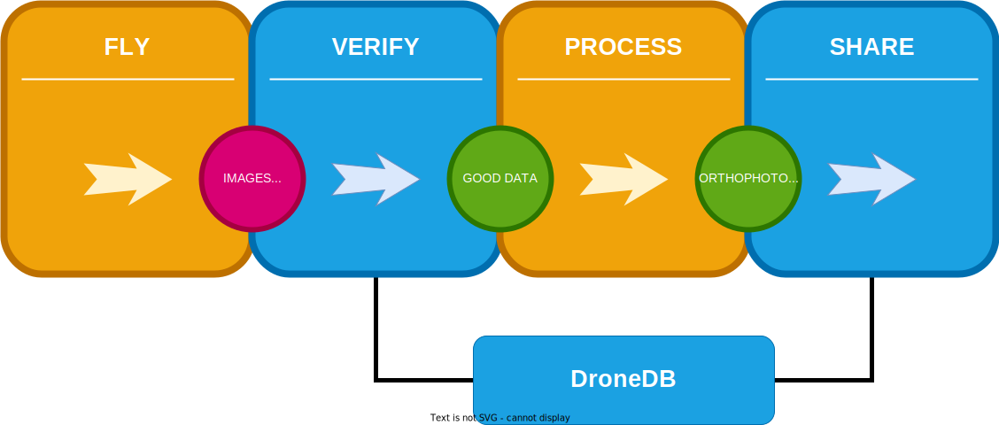
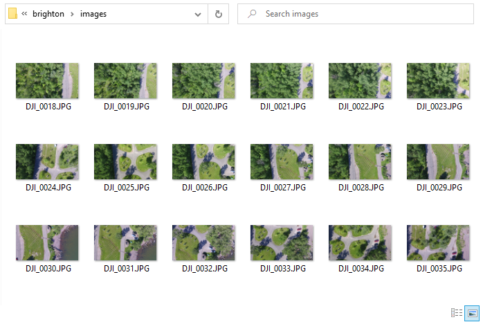
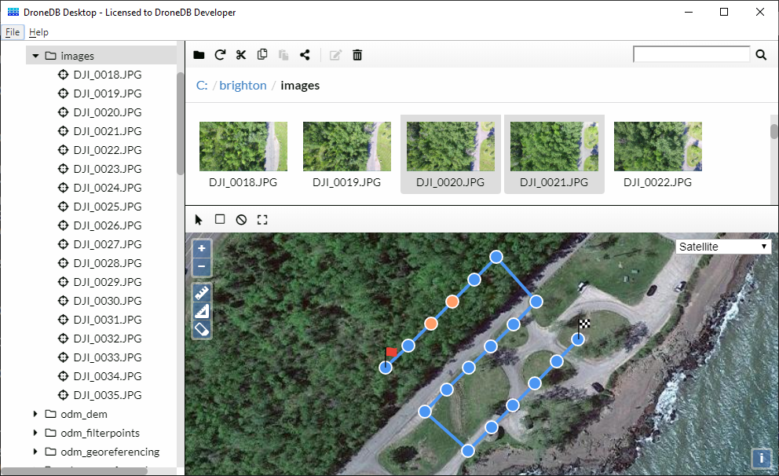
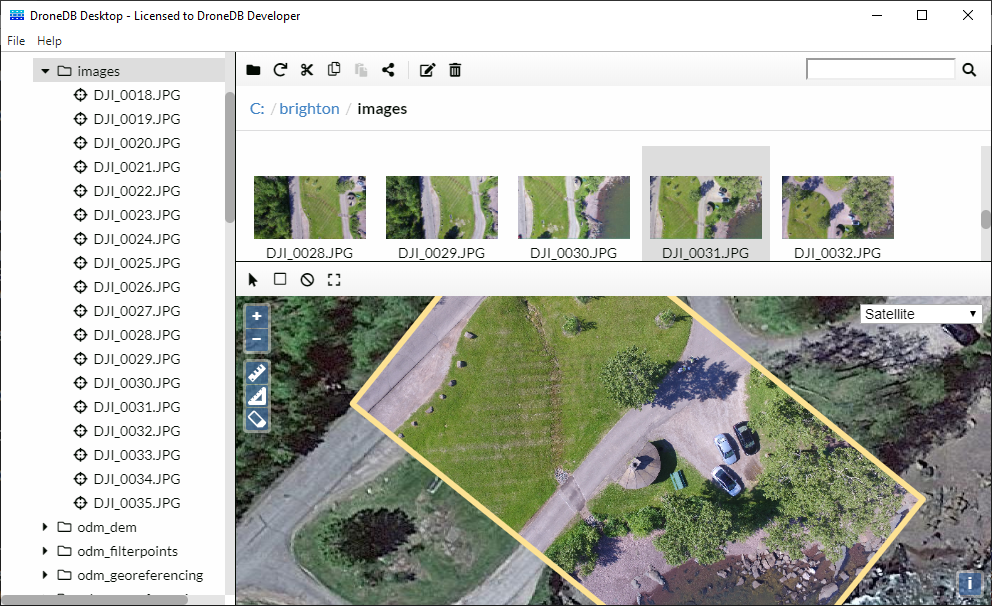
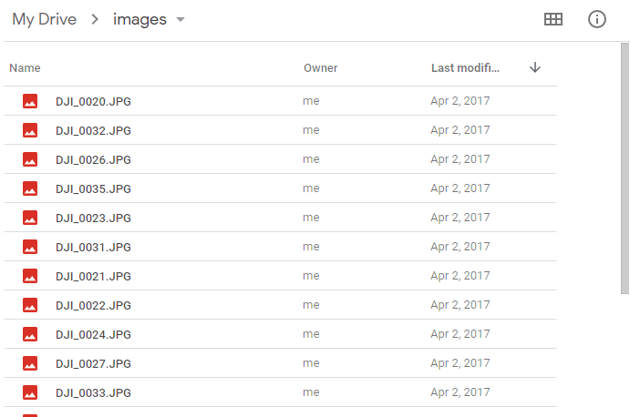
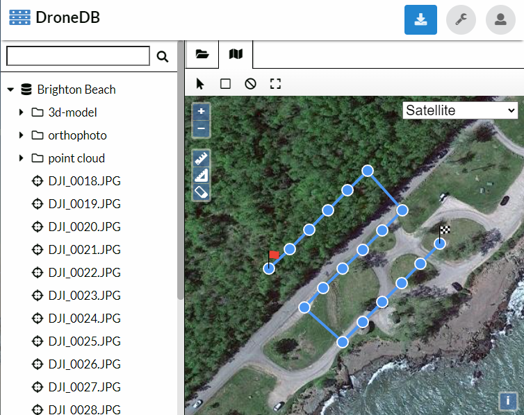
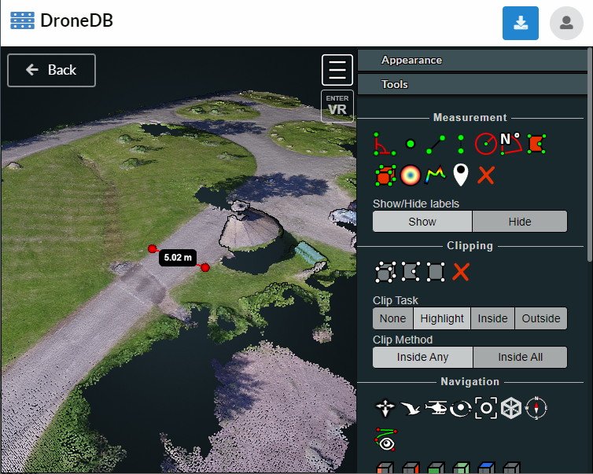

# Overview

Discover **DroneDB in less than 2 minutes**.

## What is DroneDB

A set of tools to inspect, manage and share aerial data.

**

:::info
We will soon allow for processing of data. In the meanwhile, [WebODM](https://opendronemap.org/webodm/) can help you with that.
:::

## Useful Tools

### For Inspection

You flew your drone. You captured some data. But *is your data good?*. You plug your SD card and check:

 - Are the images georeferenced correctly (or at all)?
 - Did you miss to capture an image (or an entire section)?

*Difficult to say*

DroneDB Desktop can help provide more context:

That's insightful!

Now you're ready to copy/move your images and send them to your favorite program for further processing/analysis.

You can use this tool to sort through your datasets more quickly or to examine your SD cards.

### For Sharing

If you have some aerial data:
 - Images
 - Videos
 - Orthophotos
 - Elevation Models
 - Point Clouds
 - 3D Models
 - Panoramas
 - Supporting files (PDFs, etc.)

*Where* do you put your files so others can access them?

Google Drive? Dropbox? OneDrive? iCloud?

But you and your clients cannot interact with the files until you've downloaded them.

[DroneDB Hub](https://hub.dronedb.app) is interactive; you can view images, point clouds, textured models, panoramas all in one place. You can of course download the files too.

## Get Started

 - Install [DroneDB Desktop](./desktop/installation)
 - [Register](https://dronedb.app/register) an account on Hub (it's free)

### Advanced Users

 - Self-host your Hub with [Registry](./registry) or [Server](./server)
 - Install the [command line tool](./CLI)