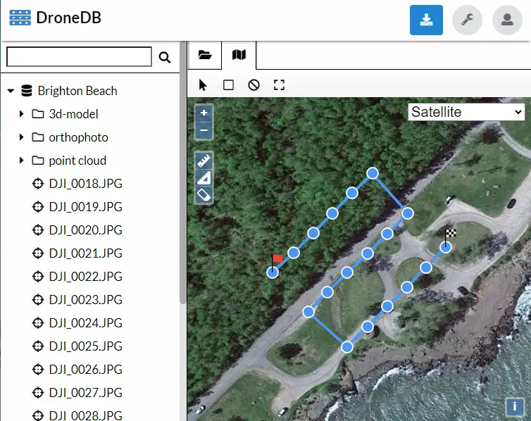
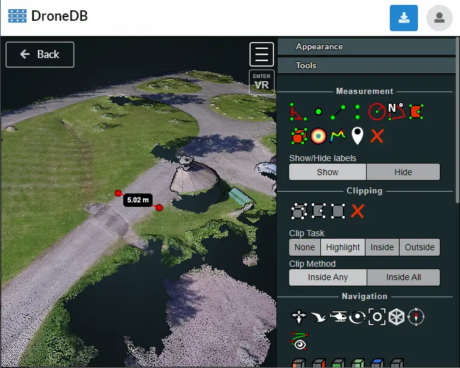
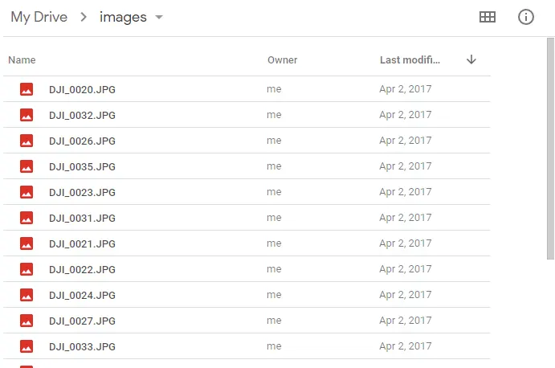

# Overview

Discover **DroneDB in less than 2 minutes**.

## What is DroneDB

A comprehensive set of tools to inspect, manage, and share geospatial data. DroneDB provides a complete solution for organizing and distributing images, orthophotos, digital elevation models, point clouds, 3D models, and vector files.

:::info
For image processing and photogrammetry, we recommend [WebODM](https://docs.webodm.org). DroneDB excels at managing and sharing the resulting data.
:::

## Core Components

DroneDB consists of two main components:

| Component | Description |
|-----------|-------------|
| **DroneDB Core** | C++ library providing geospatial data management, indexing, and processing |
| **DroneDB Registry** | Web-based platform for hosting, managing and sharing datasets |

:::warning Desktop Application Deprecated
DroneDB Desktop (the standalone Windows application) has been deprecated and is being phased out. All functionality has been moved to the web-based [Registry/Hub](https://hub.dronedb.app) platform. We recommend using Registry for all data inspection and sharing workflows.

**Existing Desktop license holders**: if you purchased a DroneDB Desktop license, you are entitled to **3 months free** of the **Professional plan** on [DroneDB Hub](https://hub.dronedb.app). Contact us at [support@dronedb.app](mailto:support@dronedb.app) to activate your offer.
:::

## Key Features

### Data Inspection

You have some geospatial data. But *is your data good?*

 - Are the images georeferenced correctly (or at all)?
 - Did you miss to capture an image (or an entire section)?

*Difficult to say from a file browser*

[DroneDB Hub](https://hub.dronedb.app) provides rich context and visualization directly in your browser:

### Data Sharing

DroneDB supports a wide range of geospatial data formats:

| Category | Supported Formats |
|----------|-------------------|
| **Images** | JPG, JPEG, DNG, TIF, TIFF, PNG, GIF, WEBP |
| **Multispectral / Thermal** | Multi-band GeoTIFF, FLIR R-JPEG, thermal GeoTIFF |
| **Videos** | MP4, MOV, WEBM, M4V, AVI, MKV |
| **Point Clouds** | LAS, LAZ, E57, PTS, XYZ, PLY* |
| **3D Models** | OBJ, GLTF, GLB, PLY* |
| **Gaussian Splats** | PLY*, SPLAT, SPZ, KSPLAT |
| **Vector Data** | GeoJSON, DXF, DWG, SHP, SHZ, FGB, TopoJSON, KML, KMZ, GPKG |
| **Other** | Markdown, and generic files (PDF, etc.) |

:::note
*PLY files are automatically classified as point clouds, 3D models, or Gaussian Splats based on their content. Textured PLY files are treated as generic files.
:::

Traditional cloud storage like Google Drive or Dropbox doesn't let you interact with geospatial data:

[DroneDB Hub](https://hub.dronedb.app) is interactive; you can view images, point clouds, textured models, panoramas all in one place with **measurements tools**, **STAC support**, and more:

### Key Capabilities

- **Automatic Metadata Extraction**: EXIF, sensor data, GPS coordinates
- **Spatial Indexing**: SQLite with SpatiaLite extensions
- **On-Demand Processing**: Dynamic tiling, thumbnails, EPT generation
- **3D Streaming**: Nexus format for efficient mesh streaming
- **STAC Compliance**: Standard catalog format for interoperability
- **Public & Private Datasets**: Flexible visibility controls

### Entry Types

DroneDB automatically classifies files into the following types based on their content and metadata:

| Type | Description |
|------|-------------|
| **Image** | Standard images (JPG, PNG, etc.) without GPS data |
| **GeoImage** | Georeferenced images with GPS coordinates |
| **Panorama** | Wide-angle images (aspect ratio ≥ 2:1) |
| **GeoPanorama** | Panoramas with GPS coordinates |
| **Video** | Standard video files |
| **GeoVideo** | Videos with embedded GPS data |
| **GeoRaster** | Georeferenced rasters (orthophotos, DEMs, multispectral) |
| **PointCloud** | Point cloud files (LAS, LAZ, E57, PTS, XYZ, non-mesh PLY) |
| **Model** | 3D models (OBJ, GLTF, GLB, mesh PLY) |
| **GaussianSplat** | Gaussian Splat files (PLY splat, SPZ, SPLAT, KSPLAT) |
| **Vector** | Vector data (GeoJSON, SHP, KML, DXF, GPKG, etc.) |
| **Markdown** | Documentation files (.md) |
| **Directory** | Filesystem directories |
| **Generic** | Files with no special handling |
| **DroneDB** | Directories containing a .ddb database |

## Get Started

 - [Register](https://dronedb.app/register) an account on Hub (it's free)
 - Explore your first dataset at [hub.dronedb.app](https://hub.dronedb.app)

### Advanced Users

 - Self-host your own instance with [Registry](/docs/registry)
 - Install the [command line tool](/docs/cli/cli-reference)
 - See [Getting Started](/docs/getting-started) for a complete walkthrough
