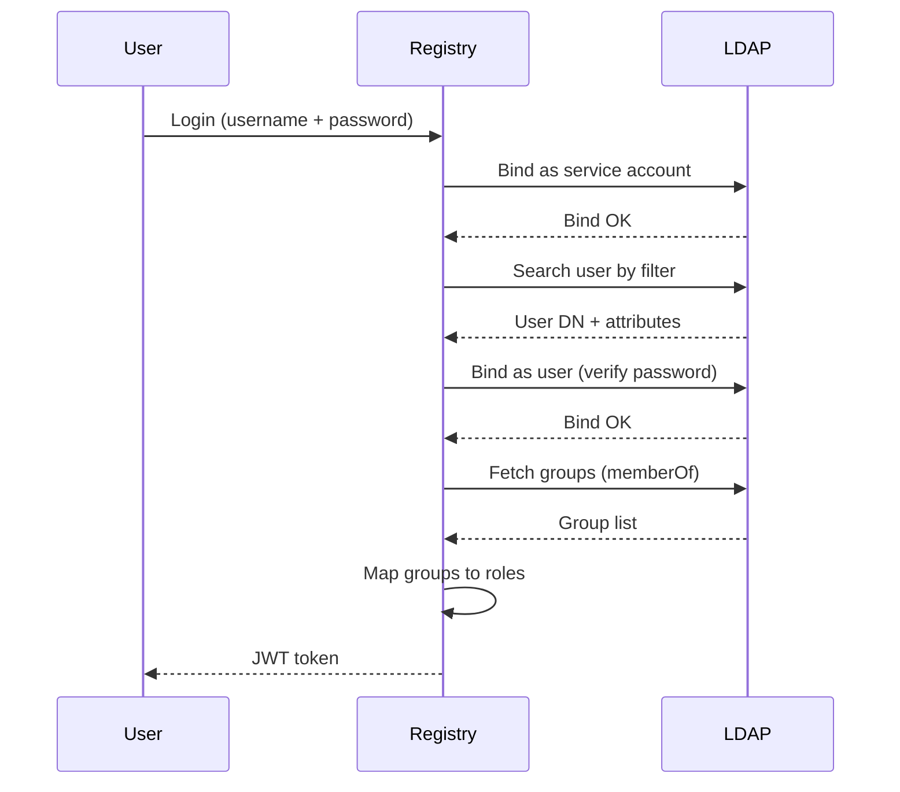

# LDAP / Active Directory Authentication

Registry supports LDAP and Active Directory authentication as an alternative to the built-in local authentication system. When enabled, user credentials are validated against an LDAP/AD server, and user attributes (email, display name, group memberships) are synchronized automatically.

:::note
LDAP authentication is **mutually exclusive** with external authentication (`ExternalAuthUrl`). You cannot enable both simultaneously.
:::

## Overview



### Authentication Flow

Registry supports two authentication paths:

1. **Service Account Search (recommended):** A service account searches the directory for the user's DN, then binds as the user to verify the password. This path also retrieves user attributes (email, display name, groups).

2. **Direct Bind (UserDnFormat):** If `UserDnFormat` is configured, Registry constructs the user's DN directly from the username and attempts a bind without a search step. This is useful for environments where the user DN follows a predictable pattern (e.g., UPN or fixed OU).

### Group-Based Role Assignment

Members of LDAP groups listed in `AdminGroupDns` automatically receive the Registry `admin` role. Group membership is determined via the `memberOf` attribute (configurable via `GroupMembershipAttribute`).

## Enabling LDAP

Add the `LdapSettings` block to `appsettings.json`:

```json
{
  "AppSettings": {
    "LdapSettings": {
      "Enabled": true,
      "Server": "ldap.example.com",
      "Port": 636,
      "UseSsl": true,
      "ValidateSslCertificate": true,
      "BaseDn": "dc=example,dc=com",
      "BindDn": "cn=serviceuser,ou=svcaccts,dc=example,dc=com",
      "BindPassword": "service-password",
      "SearchFilter": "(sAMAccountName={0})",
      "AdminGroupDns": [
        "ou=registry-admins,ou=groups,dc=example,dc=com"
      ],
      "EmailAttribute": "mail",
      "DisplayNameAttribute": "displayName",
      "GroupMembershipAttribute": "memberOf",
      "Timeout": 30
    }
  }
}
```

Or via environment variables (use `__` as separator for nested properties):

```bash
AppSettings__LdapSettings__Enabled=true
AppSettings__LdapSettings__Server=ldap.example.com
AppSettings__LdapSettings__Port=636
AppSettings__LdapSettings__BaseDn=dc=example,dc=com
AppSettings__LdapSettings__BindDn=cn=serviceuser,ou=svcaccts,dc=example,dc=com
AppSettings__LdapSettings__BindPassword=service-password
AppSettings__LdapSettings__SearchFilter=(sAMAccountName={0})
```

## Configuration Reference

### LdapSettings Properties

| Property | Type | Default | Description |
|----------|------|---------|-------------|
| `Enabled` | `bool` | `false` | Enables LDAP/Active Directory authentication |
| `Server` | `string` | — | LDAP server hostname or IP address |
| `Port` | `int` | `636` | LDAP port (389 for plain LDAP, 636 for LDAPS) |
| `UseSsl` | `bool` | `true` | Use SSL/TLS (LDAPS). **Strongly recommended in production** |
| `ValidateSslCertificate` | `bool` | `true` | Validate the server SSL certificate chain. Set to `false` only for testing with self-signed certificates |
| `BaseDn` | `string` | — | Base DN for directory searches (e.g., `dc=example,dc=com`) |
| `BindDn` | `string` | `null` | Service account DN for the initial search bind. If `null`, an anonymous bind is attempted |
| `BindPassword` | `string` | — | Password for the service account. **Never commit in plain text** — use environment variables or secrets management |
| `SearchFilter` | `string` | `(sAMAccountName={0})` | LDAP search filter to locate the user. `{0}` is replaced with the escaped username |
| `UserDnFormat` | `string` | `null` | Optional format string for constructing the user DN directly (bypasses search). `{0}` is replaced with the username |
| `AdminGroupDns` | `string[]` | `[]` | Distinguished names of LDAP groups whose members receive the Registry admin role |
| `EmailAttribute` | `string` | `mail` | LDAP attribute for the user email address |
| `DisplayNameAttribute` | `string` | `displayName` | LDAP attribute for the user's display name |
| `GroupMembershipAttribute` | `string` | `memberOf` | LDAP attribute listing group memberships |
| `Timeout` | `int` | `30` | Timeout in seconds for LDAP operations |

:::warning Required Fields
When `Enabled` is `true`, the following fields are **required**: `Server`, `BaseDn`, and `SearchFilter`. Registry will refuse to start if these are missing.
:::

## Active Directory Example

```json
{
  "AppSettings": {
    "LdapSettings": {
      "Enabled": true,
      "Server": "dc.domain.com",
      "Port": 636,
      "UseSsl": true,
      "ValidateSslCertificate": true,
      "BaseDn": "dc=domain,dc=com",
      "BindDn": "CN=registry-svc,CN=Users,DC=domain,DC=com",
      "BindPassword": "svc-password",
      "SearchFilter": "(sAMAccountName={0})",
      "AdminGroupDns": [
        "CN=Registry-Admins,CN=Users,DC=domain,DC=com"
      ],
      "EmailAttribute": "mail",
      "DisplayNameAttribute": "displayName",
      "GroupMembershipAttribute": "memberOf",
      "Timeout": 30
    }
  }
}
```

## OpenLDAP Example

```json
{
  "AppSettings": {
    "LdapSettings": {
      "Enabled": true,
      "Server": "ldap.example.com",
      "Port": 636,
      "UseSsl": true,
      "ValidateSslCertificate": true,
      "BaseDn": "dc=example,dc=com",
      "BindDn": "cn=registry,ou=services,dc=example,dc=com",
      "BindPassword": "svc-password",
      "SearchFilter": "(uid={0})",
      "AdminGroupDns": [
        "cn=registry-admins,ou=groups,dc=example,dc=com"
      ],
      "EmailAttribute": "mail",
      "DisplayNameAttribute": "cn",
      "GroupMembershipAttribute": "memberOf",
      "Timeout": 30
    }
  }
}
```

## Direct Bind Mode (UserDnFormat)

When the user DN follows a predictable pattern, you can skip the search step entirely by configuring `UserDnFormat`. This mode does not require a service account (`BindDn` can be `null`).

### UPN Example (Active Directory)

```json
{
  "AppSettings": {
    "LdapSettings": {
      "Enabled": true,
      "Server": "dc.domain.com",
      "Port": 636,
      "UseSsl": true,
      "BaseDn": "dc=domain,dc=com",
      "UserDnFormat": "{0}@domain.com",
      "SearchFilter": "(sAMAccountName={0})",
      "AdminGroupDns": ["CN=Registry-Admins,CN=Users,DC=domain,DC=com"],
      "EmailAttribute": "mail",
      "DisplayNameAttribute": "displayName",
      "GroupMembershipAttribute": "memberOf"
    }
  }
}
```

### Fixed OU Example (OpenLDAP)

```json
{
  "AppSettings": {
    "LdapSettings": {
      "Enabled": true,
      "Server": "ldap.example.com",
      "Port": 636,
      "UseSsl": true,
      "BaseDn": "dc=example,dc=com",
      "UserDnFormat": "uid={0},ou=people,dc=example,dc=com",
      "SearchFilter": "(uid={0})",
      "AdminGroupDns": ["cn=registry-admins,ou=groups,dc=example,dc=com"],
      "EmailAttribute": "mail",
      "DisplayNameAttribute": "cn",
      "GroupMembershipAttribute": "memberOf"
    }
  }
}
```

:::note
Even when using `UserDnFormat`, the `SearchFilter` property is still required for attribute retrieval (email, display name, group memberships) after the user binds.
:::

## Health Check

When LDAP is enabled, Registry registers an `LDAP health check` that verifies connectivity to the LDAP server at startup and periodically via the `/health` endpoint. The health check performs one of the following:

- **Service account bind:** If `BindDn` is configured, the health check binds with the service account.
- **Anonymous bind:** If no service account is configured, an anonymous bind is attempted. Many LDAP/AD servers reject anonymous binds by policy even when reachable — in this case, the health check reports **Degraded** (reachable but not fully validated) rather than **Unhealthy**.

### Health Check States

| State | Meaning |
|-------|---------|
| **Healthy** | LDAP server is reachable and the bind (service or anonymous) succeeded |
| **Degraded** | LDAP server is reachable but the anonymous bind was rejected (configure `BindDn` for full validation) |
| **Unhealthy** | LDAP server is not reachable (network error, timeout, or connection refused) |

## Capabilities

When LDAP authentication is enabled, the following capabilities apply:

| Capability | Value |
|------------|-------|
| `SupportsLocalUserManagement` | `false` — identity is managed externally |
| `SupportsPasswordChange` | `false` — passwords are managed in LDAP/AD |
| `ManagesRolesExternally` | `true` — admin role is assigned based on LDAP group membership |
| `ManagesProfileExternally` | `true` — email and display name are synchronized from LDAP |

This means users cannot change their password through the Registry UI, and user profiles (email, display name) are read from the LDAP directory on each authentication.

## Security Considerations

- **Always use LDAPS (SSL/TLS)** in production. Set `UseSsl: true` and `Port: 636`.
- **Validate SSL certificates** (`ValidateSslCertificate: true`) unless using self-signed certificates for testing.
- **Never commit `BindPassword`** in plain text. Use environment variables or a secrets manager.
- **Use a dedicated service account** with minimal permissions (read-only access to user attributes and group memberships).
- **LDAP filter injection** is prevented automatically — user-supplied input is escaped per RFC 4515 before being inserted into search filters.

## Troubleshooting

### Common Issues

| Issue | Solution |
|-------|----------|
| `LdapSettings.Server is required when LDAP is enabled` | Add the `Server` property to `LdapSettings` |
| `LdapSettings.BaseDn is required when LDAP is enabled` | Add the `BaseDn` property (e.g., `dc=example,dc=com`) |
| `LdapSettings.SearchFilter must contain the '{0}' placeholder` | Include `{0}` in the search filter (e.g., `(sAMAccountName={0})`) |
| `Cannot enable both LDAP and External authentication simultaneously` | Remove `ExternalAuthUrl` when using LDAP, or vice versa |
| LDAP health check reports **Degraded** | The server rejects anonymous binds. Configure `BindDn` and `BindPassword` for full validation |
| User authenticates but email/display name is empty | Verify `EmailAttribute` and `DisplayNameAttribute` match the actual LDAP attribute names |
| Admin role not assigned | Verify `AdminGroupDns` matches the exact DN of the LDAP group and that the user is a member |

### Testing Connectivity

You can test LDAP connectivity using the health check endpoint:

```bash
curl http://localhost:5000/health
```

The response will include the LDAP health check status if LDAP is enabled.

## Migration from Local Authentication

When switching from local to LDAP authentication:

1. **Backup** the existing database before making changes.
2. Configure `LdapSettings` in `appsettings.json`.
3. Restart Registry.
4. Existing local users will **not** be able to log in with their local credentials. Users must authenticate via LDAP.
5. To preserve admin access, ensure at least one LDAP user is a member of a group listed in `AdminGroupDns`.

:::warning
After enabling LDAP, the local password-based login is disabled. Make sure LDAP authentication is working before closing the configuration.
:::
