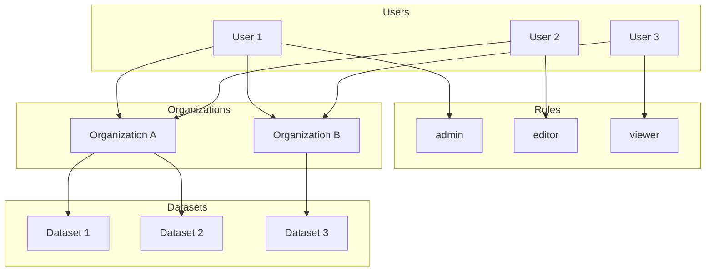
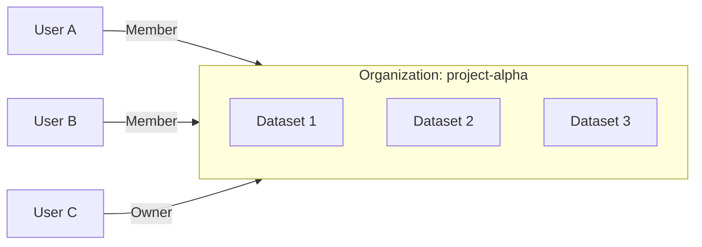
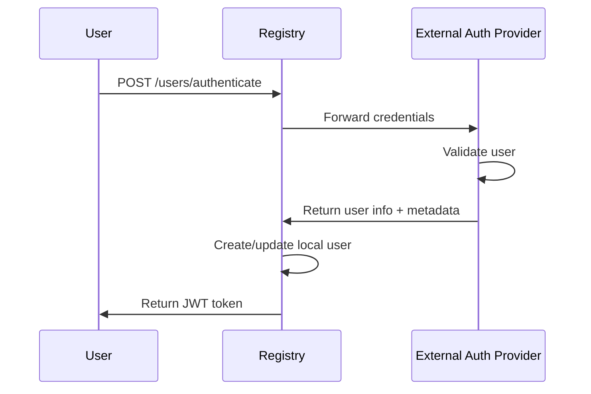
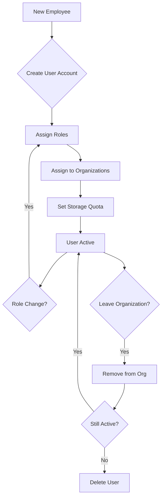

# User Management

Registry includes a comprehensive user management system with role-based access control (RBAC), organization management, and storage quotas. This guide covers all aspects of managing users in a Registry deployment.


:::tip
For information on basic Registry setup and configuration, see the [Registry documentation](./registry.md).
:::

## Overview

The user management system provides:

- **User Administration**: Create, update, and delete user accounts
- **Role-Based Access Control**: Define custom roles and assign permissions
- **Organization Membership**: Control which organizations users can access
- **Storage Quotas**: Limit storage usage per user
- **Authentication**: JWT-based authentication with support for external providers
- **Metadata Management**: Store custom user attributes



## User Accounts

### Default Admin Account

When Registry starts for the first time, a default administrator account is created:

| Field | Default Value |
|-------|---------------|
| Username | `admin` |
| Password | `password` |
| Email | `admin@example.com` |

:::warning Security Notice
**Change the default password immediately** after first login. Navigate to [/account](http://localhost:5000/account) or use the API to update credentials.
:::

You can customize the default admin in `appsettings.json`:

```json
{
  "DefaultAdmin": {
    "Email": "admin@yourdomain.com",
    "UserName": "admin",
    "Password": "your-secure-password"
  }
}
```

### Creating Users

Administrators can create new users through the web interface or API.


#### Via Web Interface

1. Log in as an administrator
2. Navigate to **Settings** → **Users**
3. Click **Add User**
4. Fill in the required fields:
   - **Username**: Unique identifier (alphanumeric, no spaces)
   - **Email**: Valid email address
   - **Password**: Secure password
   - **Roles**: Select one or more roles
5. Click **Create**

#### Via REST API

```bash
curl -X POST http://localhost:5000/users \
  -H "Authorization: Bearer <admin-token>" \
  -H "Content-Type: application/json" \
  -d '{
    "userName": "newuser",
    "email": "newuser@example.com",
    "password": "securepassword123",
    "roles": ["user"]
  }'
```

**Response:**
```json
{
  "userName": "newuser",
  "email": "newuser@example.com",
  "roles": ["user"],
  "organizations": []
}
```

### Viewing Users

Administrators can view all registered users.

#### Basic User List

```bash
GET /users
```

Returns:
```json
[
  {
    "userName": "admin",
    "email": "admin@example.com",
    "roles": ["admin"],
    "organizations": ["default-org"]
  },
  {
    "userName": "user1",
    "email": "user1@example.com",
    "roles": ["user"],
    "organizations": ["project-a", "project-b"]
  }
]
```

#### Detailed User List

For more detailed information including storage usage:

```bash
GET /users/detailed
```

Returns:
```json
[
  {
    "userName": "user1",
    "email": "user1@example.com",
    "roles": ["user"],
    "organizations": ["project-a"],
    "storageQuota": 10737418240,
    "storageUsed": 5368709120,
    "organizationCount": 1,
    "datasetCount": 5,
    "createdDate": "2024-01-15T10:30:00Z"
  }
]
```


### Updating Users

Update user information including email and roles:

```bash
curl -X PUT http://localhost:5000/users/username \
  -H "Authorization: Bearer <admin-token>" \
  -H "Content-Type: application/json" \
  -d '{
    "email": "newemail@example.com",
    "roles": ["user", "editor"]
  }'
```

### Deleting Users

Remove a user account:

```bash
curl -X DELETE http://localhost:5000/users/username \
  -H "Authorization: Bearer <admin-token>"
```

:::caution
Deleting a user does not automatically delete their organizations or datasets. Consider transferring ownership before deletion.
:::

## Password Management

### Changing Own Password

Users can change their own password:

```bash
curl -X POST http://localhost:5000/users/changepwd \
  -H "Authorization: Bearer <token>" \
  -H "Content-Type: application/x-www-form-urlencoded" \
  -d "oldPassword=currentPassword&newPassword=newSecurePassword"
```

### Admin Password Reset

Administrators can change any user's password:

```bash
curl -X PUT http://localhost:5000/users/username/changepwd \
  -H "Authorization: Bearer <admin-token>" \
  -H "Content-Type: application/json" \
  -d '{
    "currentPassword": null,
    "newPassword": "newSecurePassword"
  }'
```

:::tip
When an admin changes another user's password, the `currentPassword` field can be omitted or set to null.
:::


## Roles and Permissions

Registry uses a role-based access control system. Users can have one or more roles that determine their permissions.

### Built-in Roles

| Role | Description | Permissions |
|------|-------------|-------------|
| `admin` | System administrator | Full access to all features |
| `user` | Standard user | Create/manage own organizations and datasets |

### Custom Roles

Administrators can create custom roles for fine-grained access control.

#### Creating a Role

```bash
curl -X POST http://localhost:5000/users/roles \
  -H "Authorization: Bearer <admin-token>" \
  -H "Content-Type: application/json" \
  -d '{
    "roleName": "editor"
  }'
```

#### Listing Roles

```bash
curl http://localhost:5000/users/roles \
  -H "Authorization: Bearer <token>"
```

Response:
```json
["admin", "user", "editor", "viewer"]
```

#### Deleting a Role

```bash
curl -X DELETE http://localhost:5000/users/roles/rolename \
  -H "Authorization: Bearer <admin-token>"
```

:::warning
The `admin` role cannot be deleted. Ensure no users are assigned to a role before deleting it.
:::

### Assigning Roles to Users

Roles are assigned when creating or updating a user:

```bash
curl -X PUT http://localhost:5000/users/username \
  -H "Authorization: Bearer <admin-token>" \
  -H "Content-Type: application/json" \
  -d '{
    "email": "user@example.com",
    "roles": ["user", "editor"]
  }'
```


## Organizations

Organizations group datasets and users. Users must belong to an organization to create and manage datasets within it.



### Organization Structure

| Field | Description |
|-------|-------------|
| `slug` | Unique URL-friendly identifier |
| `name` | Display name |
| `description` | Optional description |
| `owner` | Username of the organization owner |
| `isPublic` | Whether the organization is publicly visible |
| `creationDate` | When the organization was created |

### Managing User Organizations

#### View User's Organizations

```bash
curl http://localhost:5000/users/username/orgs \
  -H "Authorization: Bearer <admin-token>"
```

Response:
```json
[
  {
    "slug": "project-alpha",
    "name": "Project Alpha",
    "description": "Main project organization",
    "creationDate": "2024-01-01T00:00:00Z",
    "owner": "admin",
    "isPublic": true
  }
]
```

#### Assign Organizations to User

```bash
curl -X PUT http://localhost:5000/users/username/orgs \
  -H "Authorization: Bearer <admin-token>" \
  -H "Content-Type: application/x-www-form-urlencoded" \
  -d "orgSlugs=project-alpha&orgSlugs=project-beta"
```


### Creating Organizations

```bash
curl -X POST http://localhost:5000/orgs \
  -H "Authorization: Bearer <token>" \
  -H "Content-Type: application/x-www-form-urlencoded" \
  -d "slug=my-org&name=My Organization&description=A new organization&isPublic=true"
```

### Updating Organizations

```bash
curl -X PUT http://localhost:5000/orgs/my-org \
  -H "Authorization: Bearer <token>" \
  -H "Content-Type: application/x-www-form-urlencoded" \
  -d "name=Updated Name&description=Updated description&isPublic=false"
```

### Deleting Organizations

```bash
curl -X DELETE http://localhost:5000/orgs/my-org \
  -H "Authorization: Bearer <token>"
```

:::caution
Deleting an organization will delete all datasets within it. This action cannot be undone.
:::

## Storage Quotas

Registry can limit storage usage per user when `EnableStorageLimiter` is enabled.

### Enabling Storage Limits

In `appsettings.json`:

```json
{
  "EnableStorageLimiter": true
}
```

### Setting User Storage Quota

Storage quotas are set via user metadata using the `maxStorageMB` key:

```bash
curl -X POST http://localhost:5000/users/username/meta \
  -H "Authorization: Bearer <admin-token>" \
  -H "Content-Type: application/json" \
  -d '{
    "maxStorageMB": 10240
  }'
```

This sets a 10 GB (10240 MB) storage limit for the user.

### Viewing Storage Usage

#### Current User

```bash
curl http://localhost:5000/users/storage \
  -H "Authorization: Bearer <token>"
```

#### Specific User (Admin)

```bash
curl http://localhost:5000/users/username/storage \
  -H "Authorization: Bearer <admin-token>"
```

Response:
```json
{
  "total": 10737418240,
  "used": 5368709120
}
```

- `total`: Storage quota in bytes (null if unlimited)
- `used`: Current storage usage in bytes


### Storage Quota Behavior

When storage limits are enabled:

| Scenario | Behavior |
|----------|----------|
| Under quota | Normal operation |
| At quota | New uploads rejected |
| No quota set | Unlimited storage |
| Quota disabled globally | All users have unlimited storage |

## User Metadata

User metadata stores custom attributes as key-value pairs. This is useful for storing additional user information or integrating with external systems.

### Getting User Metadata

#### Current User

```bash
curl http://localhost:5000/users/meta \
  -H "Authorization: Bearer <token>"
```

#### Specific User (Admin)

```bash
curl http://localhost:5000/users/username/meta \
  -H "Authorization: Bearer <admin-token>"
```

### Setting User Metadata

```bash
curl -X POST http://localhost:5000/users/username/meta \
  -H "Authorization: Bearer <admin-token>" \
  -H "Content-Type: application/json" \
  -d '{
    "maxStorageMB": 10240,
    "department": "Engineering",
    "customField": "customValue"
  }'
```

### Reserved Metadata Keys

| Key | Description | Type |
|-----|-------------|------|
| `maxStorageMB` | Storage quota in megabytes | number |
| `roles` | Role assignments from external auth | array |

## Authentication

### JWT Authentication

Registry uses JSON Web Tokens (JWT) for authentication.

#### Login

```bash
curl -X POST http://localhost:5000/users/authenticate \
  -H "Content-Type: application/x-www-form-urlencoded" \
  -d "username=admin&password=password"
```

Response:
```json
{
  "token": "eyJhbGciOiJIUzI1NiIsInR5cCI6IkpXVCJ9...",
  "expires": "2024-01-22T10:30:00Z",
  "userName": "admin",
  "email": "admin@example.com",
  "roles": ["admin"]
}
```

#### Token Refresh

Refresh an active token before expiration:

```bash
curl -X POST http://localhost:5000/users/authenticate/refresh \
  -H "Authorization: Bearer <token>"
```

#### Token Configuration

In `appsettings.json`:

```json
{
  "Secret": "your-long-random-secret-key",
  "TokenExpirationInDays": 7,
  "AuthCookieName": "jwtToken"
}
```

:::warning Security
Use a strong, unique `Secret` for JWT signing. The secret should be at least 32 characters and generated using a cryptographically secure random number generator.
:::

### External Authentication

For enterprise deployments, Registry supports external authentication providers.



#### Configuration

In `appsettings.json`:

```json
{
  "ExternalAuthUrl": "https://auth.yourdomain.com/api/authenticate"
}
```

#### Behavior

When `ExternalAuthUrl` is configured:

- Local user management is disabled
- Users cannot be created, updated, or deleted locally
- All authentication is delegated to the external provider
- User roles and metadata come from the external provider's response
- The `/users/management-enabled` endpoint returns `false`

#### Checking Management Status

```bash
curl http://localhost:5000/users/management-enabled
```

Response:
- `true` - Local user management is enabled
- `false` - External authentication is configured


## API Reference

### Users Endpoints

| Method | Endpoint | Description | Auth |
|--------|----------|-------------|------|
| `POST` | `/users/authenticate` | Authenticate user | No |
| `POST` | `/users/authenticate/refresh` | Refresh JWT token | Yes |
| `POST` | `/users` | Create new user | Admin |
| `GET` | `/users` | List all users | Admin |
| `GET` | `/users/detailed` | List users with details | Admin |
| `PUT` | `/users/{userName}` | Update user | Admin |
| `DELETE` | `/users/{userName}` | Delete user | Admin |
| `POST` | `/users/changepwd` | Change own password | Yes |
| `PUT` | `/users/{userName}/changepwd` | Change user password | Admin |
| `GET` | `/users/roles` | List all roles | Yes |
| `POST` | `/users/roles` | Create role | Admin |
| `DELETE` | `/users/roles/{roleName}` | Delete role | Admin |
| `GET` | `/users/storage` | Get own storage info | Yes |
| `GET` | `/users/{userName}/storage` | Get user storage info | Admin |
| `GET` | `/users/meta` | Get own metadata | Yes |
| `GET` | `/users/{userName}/meta` | Get user metadata | Admin |
| `POST` | `/users/{userName}/meta` | Set user metadata | Admin |
| `GET` | `/users/{userName}/orgs` | Get user organizations | Admin |
| `PUT` | `/users/{userName}/orgs` | Set user organizations | Admin |
| `GET` | `/users/management-enabled` | Check if management enabled | No |

### Organizations Endpoints

| Method | Endpoint | Description | Auth |
|--------|----------|-------------|------|
| `GET` | `/orgs` | List all organizations | No |
| `GET` | `/orgs/{orgSlug}` | Get organization details | No |
| `POST` | `/orgs` | Create organization | Yes |
| `PUT` | `/orgs/{orgSlug}` | Update organization | Yes |
| `DELETE` | `/orgs/{orgSlug}` | Delete organization | Yes |

## Best Practices

### Security Recommendations

1. **Change default credentials** immediately after installation
2. **Use strong passwords** with a minimum of 12 characters
3. **Set appropriate token expiration** based on your security requirements
4. **Use HTTPS** in production (via reverse proxy)
5. **Regularly audit** user accounts and remove inactive users
6. **Implement least privilege** - assign minimum necessary roles

### User Management Workflow



### Storage Quota Guidelines

| User Type | Recommended Quota |
|-----------|------------------|
| Standard User | 5-10 GB |
| Power User | 50-100 GB |
| Project Lead | 100-500 GB |
| Administrator | Unlimited |

## Troubleshooting

### Common Issues

**Cannot create users**
- Verify you have admin privileges
- Check if external authentication is configured (`management-enabled` returns `false`)
- Check server logs for error details

**Authentication fails**
- Verify username and password are correct
- Check token expiration
- Clear browser cookies and try again
- Verify the `Secret` in configuration is consistent

**Storage quota not working**
- Ensure `EnableStorageLimiter` is `true` in configuration
- Verify `maxStorageMB` is set in user metadata
- Check that the value is a valid number

**Cannot delete admin role**
- The `admin` role is protected and cannot be deleted
- Ensure at least one user has admin privileges

### Viewing Logs

Check the Registry logs for detailed error messages:

```bash
# Docker
docker-compose logs registry

# Native
cat registry-data/logs/registry.txt
```

## Related Documentation

- [Registry Overview](./registry.md) - Installation and configuration
- [CLI Reference](./cli.mdx) - Command line tools
- [STAC API](./registry.md#stac-api) - Data discovery API
